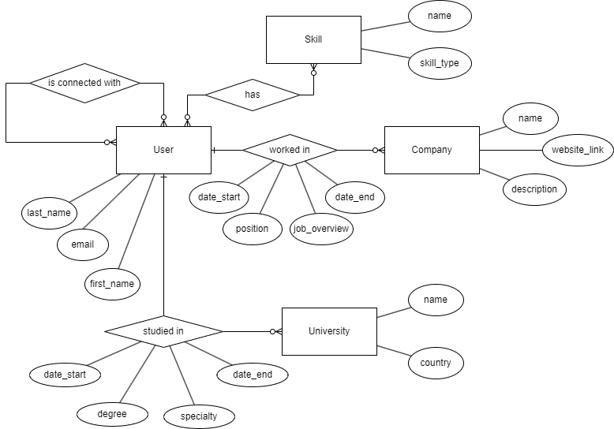

# Розрахунково-графічна робота

## з дисципліни "Бази даних"

## на тему "Створення додатку бази даних, орієнтованого на взаємодію з СУБД PostgreSQL"

### виконана: КВ-23 Молчембаєв Ярослав

Структура бази даних з лабораторної роботи №1:

